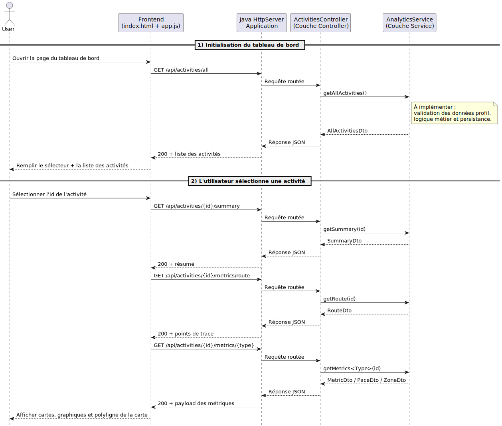
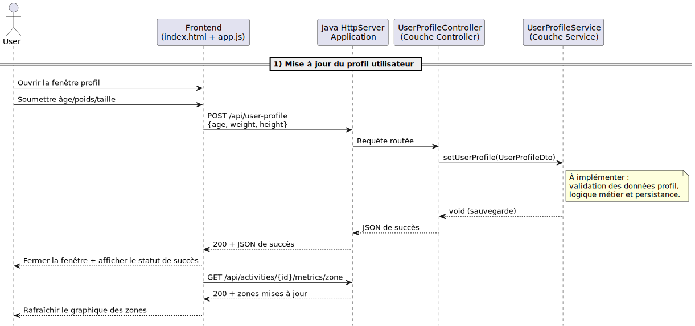

# Milestone 1

La première partie du projet porte sur la mise en place d'une architecture évolutive, puis sur le développement de fonctionnalités clés.

## Attendus et Fonctionnalités

A l'issue de cette première partie, nous attendons les fonctionnalités suivantes:

### Chargement et extraction des données d'activité depuis un ficher CSV

Le fichier `data/strava.csv` contient une grande quantité de points GPS correspondants aux points visités par l'athlète durant ses sorties.

Les objectifs sont multiples:

- Charger le fichier dans votre programme Java.
- Regrouper les points GPS par activité.
- Identifier le type d'activité (Course à pied, Cyclisme).

> La différenciation du type d'activité peut se faire sur la base de la vitesse moyenne et/ou sur la distance parcourue.

### Récupération des données d'activité

Une fois les activités chargées dans votre application, vous devez développer les fonctionnalités qui permettent de récupérer les données dans l'application web.
Le processus de récupération des différentes données est décrit par le diagramme de séquence suivant:



#### Liste des activités

Cette fonctionnalité permet d'afficher dans le frontend la liste des activités disponibles.

Opération à implémenter dans le service :

```java
AnalyticsService.getAllActivities()
```

Route backend associée :

- `GET /api/activities/all`

DTO attendu en retour :

- `AllActivitiesDto` (contient une collection de `ActivityDto`)

#### Résumé d'une activité

Cette fonctionnalité permet d'afficher les informations principales d'une activité sélectionnée.

Opération à implémenter dans le service :

```java
AnalyticsService.getSummary(String id)
```

Route backend associée :

- `GET /api/activities/{id}/summary`

DTO attendu en retour :

- `SummaryDto`

#### Evolution de métriques durant l'activité

Cette fonctionnalité permet d'alimenter les graphiques (fréquence cardiaque, vitesse/allure, altitude, etc.) et la carte.

Opérations à implémenter dans le service :

```java
AnalyticsService.getRoute(String id)
AnalyticsService.getMetricsAltitude(String id)
AnalyticsService.getMetricsSpeed(String id)
AnalyticsService.getMetricsHeartRate(String id)
AnalyticsService.getMetricsPower(String id)
AnalyticsService.getMetricsCadence(String id)
AnalyticsService.getMetricsGroundTime(String id)
AnalyticsService.getMetricsPace(String id)
AnalyticsService.getMetricsZone(String id)
```

Route backend associée :

- `GET /api/activities/{id}/metrics/{type}`

DTO attendus en retour (selon le type demandé) :

- `RouteDto` pour `type=route`
- `MetricDto` pour les séries temporelles (`altitude`, `speed`, `heart-rate`, `power`, `cadence`, `ground-time`)
- `PaceDto` pour `type=pace`
- `ZoneDto` pour `type=zone`

### Enregistrement des informations de l'utilisateur

L'athlète doit pouvoir via l'interface compléter son profil (âge, poids taille, genre)

Ces valeurs serviront par la suite à inférer les zones de fréquence cardiaque.

Le diagramme si dessous représente les interactions qui ont lieu lorsque l'athlète met à jour ses informations.



Opération à implémenter dans le service :

```java
UserProfileService.setUserProfile(UserProfileDto userProfileDto)
```

Route backend associée :

- `POST /api/user-profile`

DTO attendu en entrée :

- `UserProfileDto` (âge, poids, taille)

Réponse attendue :

- JSON de confirmation (succès)

### Calcul du temps par zone

Cette fonctionnalité a pour but de calculer le temps passé par l'utilisateur dans chaque zone de fréquence cardiaque. Pour vous aider à définir ces zones, vous pouvez vous appuyer sur la documentation [Garmin](https://www.garmin.com/fr-FR/blog/zones-de-frequence-cardiaque-definition-utilite-et-mode-de-calcul/).

Opération à implémenter dans le service :

```java
AnalyticsService.getMetricsZone(String id)
```

Route backend associée :

- `GET /api/activities/{id}/metrics/zone`

DTO attendu en retour :

- `ZoneDto`

## Critères de validation

Le milestone 1 est considéré comme réussi si :

1. Le backend compile sans erreur
2. Le serveur backend démarre et charge les données CSV
3. Les activités chargement dans le frontend sans erreur
4. Les activités s'affichent dans la liste
5. Cliquer sur une activité affiche ses détails
6. La carte GPS de l'activité s'affiche correctement
7. Les graphiques de vitesse/allure et fréquence cardiaque se tracent correctement
8. Les tests fournis (blackbox) passent tous
9. Le code est testé, documenté et bien structuré
